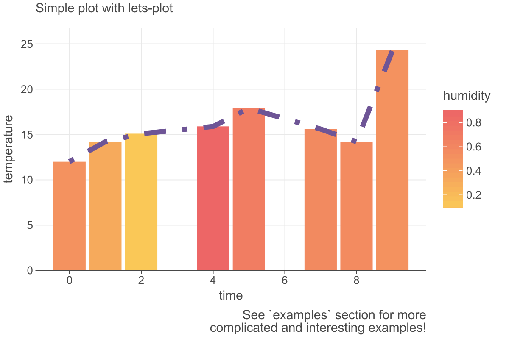

[](https://kotlinlang.org/docs/components-stability.html)
[](https://confluence.jetbrains.com/display/ALL/JetBrains+on+GitHub)
[](https://search.maven.org/artifact/org.jetbrains.kotlinx/ggdsl-api)
[](https://www.apache.org/licenses/LICENSE-2.0)

# GGDSL

Kotlin plotting DSL (and more!) inspired
by [The Grammar of Graphics](https://www.goodreads.com/book/show/2549408.The_Grammar_of_Graphics). 
*Currently, JVM-only*.

## Table of contents

<!--- TOC -->

* [What does it look-and-feel like?](#what-does-it-look-and-feel-like)
   * [Lets-Plot](#lets-plot)
   * [ECharts](#echarts)
* [Modules](#modules)
* [Using in your projects](#using-in-your-projects)
    * [Gradle](#gradle)
    * [Kotlin Jupyter Notebook](#kotlin-jupyter-notebook)
* [Contributing](#contributing)
* [About the name](#about-the-name)

<!--- END -->

## What does it look-and-feel like?

Seeing is believing; One look is worth a thousand words.

### Lets-Plot

```kotlin
val simpleDataset = mapOf(
    "time" to listOf(0, 1, 2, 4, 5, 7, 8, 9),
    "temperature" to listOf(12.0, 14.2, 15.1, 15.9, 17.9, 15.6, 14.2, 24.3),
    "humidity" to listOf(0.5, 0.32, 0.11, 0.89, 0.68, 0.57, 0.56, 0.5)
)

plot(simpleDataset) {
  x("time"<Int>())
  y("temperature"<Double>().scaled(
    continuousPos(0.0 to 25.5)
  ))

  bar {
    color("humidity"<Double>().scaled(continuous(
      rangeLimits = Color.YELLOW to Color.RED
    )))
    borderLine.width(0.0)
  }

  line {
    width(3.0)
    color(Color.hex("#6e5596"))
    type(LineType.DOTDASH)
  }

  layout {
    title = "Simple plot with lets-plot"
    caption = "See `examples` section for more\n complicated and interesting examples!"
  }
}
```


### ECharts

## Modules
* `ggdsl-api` &mdash; contains `Plot` intermediate representation (IR), base plotting DSL and internal API.
* `ggdsl-lets-plot` &mdash; plot render implementation for [Lets-Plot](https://github.com/JetBrains/lets-plot) 
with additional DSL and IR features.
* `ggdsl-dataframe` &mdash; integration with [Kotlin Dataframe](https://github.com/Kotlin/dataframe).
* `ggdsl-dataframe-lets-plot` &mdash; additional methods compatible with `dataframe` API for `lets-plot` implementation.
* `ggdsl-echarts` &mdash; plot render implementation for [Apache ECharts](https://echarts.apache.org/en/index.html)
  with additional DSL and IR features.

## Using in your projects

### Gradle 

Kotlin DSL:

- Add the Maven Central repository if it is not already there:

```kotlin
repositories {
    mavenCentral()
}
```
- Add one of the api/implementation dependency:

```groovy
dependencies {
    implementation("org.jetbrains.kotlinx:ggdsl-dataframe-lets-plot:$todo_release_version")
}
```

TODO: GroovyDSL?

### Kotlin Jupyter Notebook

Install [Kotlin kernel](https://github.com/Kotlin/kotlin-jupyter) for
[Jupyter](https://jupyter.org/)
or just visit to [Datalore](https://datalore.jetbrains.com/).

You can include all necessary dependencies, imports and renders to a notebook with "line magic":

``%use ggdsl($version)``

Use
```
%useLatestDescriptors
%use ggdsl
```
for the latest stable version.


Available descriptors:
    
* `ggdsl` &mdash; api, Lets-Plot implementation & DSL features + DataFrame integration.
* `ggdsl-lets-plot` &mdash; api, Lets-Plot implementation & DSL features.
* `ggdsl-dataframe` &mdash; api, DataFrame integration (todo remove???).
* `ggdsl-echarts` &mdash; api, ECharts implementation & DSL features. // todo with dataframe???

## Examples and documentation

TODO 

## Contributing

If the library does not provide any functionality that you need, you can create an issue.

You are welcome to contribute &mdash; you can provide an IR translation for a new render engine or create add-ons for 
an existing one.


// TODO contribution guide

## *About the name*

*The name of the library is temporary and should be changed soon. We will be very happy with suggestions.*


[Examples(Jupyter notebook with a Kotlin Kernel)](https://github.com/AndreiKingsley/lib-ggdsl/tree/main/examples)

