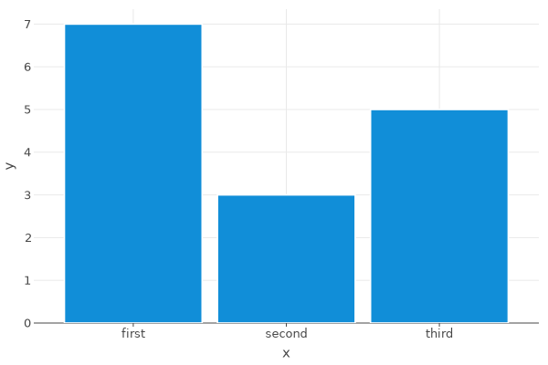
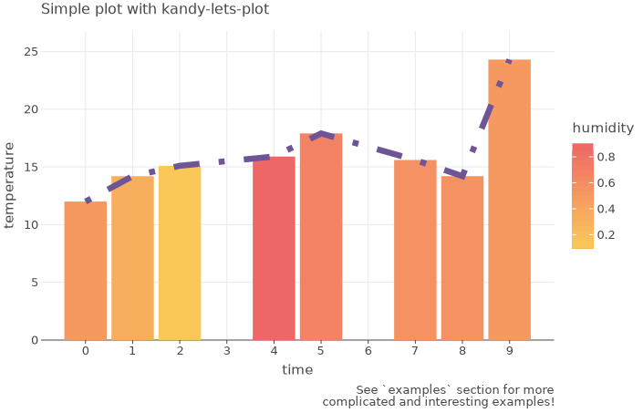
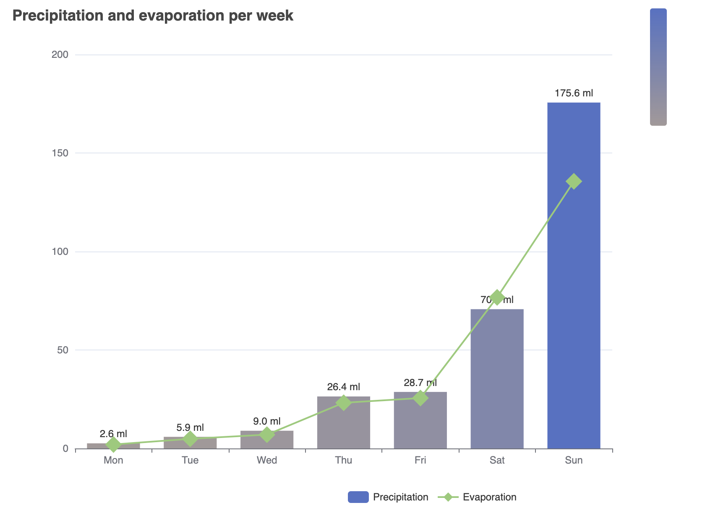

[](https://kotlinlang.org/docs/components-stability.html)
[](https://confluence.jetbrains.com/display/ALL/JetBrains+on+GitHub)
[](https://search.maven.org/artifact/org.jetbrains.kotlinx/kandy-api)
[](https://www.apache.org/licenses/LICENSE-2.0)

# Kandy

Kandy is an open-source plotting library for Kotlin
that provides a powerful and flexible DSL for creating graphs and utilizes various popular engines.

<p align="center">
  <a href="https://kotlin.github.io/kandy/welcome.html" target="_blank" rel="noopener noreferrer"
    style="display: inline-block; background-color: #645bff; color: white; padding: 10px 20px; text-decoration: none;
    border-radius: 30px; font-weight: bold;">
    Kandy Documentation
  </a>
</p>

* Cross-platform compatibility — Works effortlessly within Kotlin notebooks on various platforms,
  including IntelliJ IDEA, [Datalore](https://datalore.jetbrains.com/),
  and [Jupyter](https://jupyter.org/), as well as in standard Kotlin projects.
* Swing rendering — Features Swing rendering for outputs in the
  [Kotlin Notebook plugin](https://plugins.jetbrains.com/plugin/16340-kotlin-notebook).
* Interactive Chart features — Includes interactive tooltips for charts rendered in HTML and Swing.
* Multiple format export — Allows charts to be saved in various formats like `svg`, `png`, `html`, `jpg`/`jpeg`,
  and `tiff`.
* Kotlin collections and DataFrame support — Seamlessly integrates with Kotlin collections
  and allows graph construction using [Kotlin DataFrame](https://kotlin.github.io/dataframe/overview.html),
  especially suitable for hierarchical dataframes.
* Type and null safety — Ensures type safety and Kotlin null safety.

Inspired by [The Grammar of Graphics](https://www.goodreads.com/book/show/2549408.The_Grammar_of_Graphics).

### Quickstart

Inside [Kotlin Notebook](https://plugins.jetbrains.com/plugin/16340-kotlin-notebook),
[Datalore](https://datalore.jetbrains.com/)
or [Jupyter with Kotlin Kernel](https://github.com/Kotlin/kotlin-jupyter#readme):

```kotlin
%use kandy

plot {
  bars { 
    x(listOf("first", "second", "third"))
    y(listOf(7, 3, 5))
  }
}
```



For guidance on getting started, additional examples, and tutorials,
please refer to our [documentation](https://kotlin.github.io/kandy/welcome.html).

## Table of Contents

<!--- TOC -->

* [Overview](#overview)
* [Examples](#examples)
    * [Lets-Plot](#lets-plot)
    * [Echarts](#echarts)
* [Using Kandy](#using-kandy)
* [Contributing](#contributing)
* [Code of Conduct](#code-of-conduct)
* [License](#license)

<!--- END -->

## Overview

Kandy is a Kotlin library that provides a flexible and idiomatic DSL for creating various types of charts,
leveraging different visualization libraries.
The library aims
to make it easy and quick for users to create both basic and complex charts with many parameters and settings,
without the need for lengthy documentation.
Depending on the task, users can choose from different engines for the perfect visualization.

Kandy integrates with [Kotlin DataFrame](https://kotlin.github.io/dataframe/overview.html),
another Kotlin library for working with data, allowing for a seamless transition from data processing to final
visualization.
Additionally,
integration with `kandy-lets-plot` in [Kotlin Notebook](https://plugins.jetbrains.com/plugin/16340-kotlin-notebook)
enables high-speed chart rendering and the ability to work with large amounts of data without delays or waiting.

The library comprises the following modules:

* `kandy-api` — This module provides a simple-to-use API for creating charts.
* `kandy-lets-plot` — This module offers an implementation of
  the [Lets-Plot](https://github.com/JetBrains/lets-plot#readme) library,
  which is based by Leland Wilkinson
  work [The Grammar of Graphics](https://www.goodreads.com/book/show/2549408.The_Grammar_of_Graphics)
  and is a proven tool for creating visualizations.
* `kandy-echarts` — This module provides an implementation of
  the [Apache ECharts](https://echarts.apache.org/en/index.html) library,
  which is a widely used tool for creating interactive visualizations.

## Examples

### Lets-Plot

<!---IMPORT org.jetbrains.kotlinx.kandy.letsplot.samples.QuickStart-->

<!---FUN quickstart_sample_collections-->

```kotlin
val weatherData = mapOf(
    "time" to listOf(0, 1, 2, 4, 5, 7, 8, 9),
    "temperature" to listOf(12.0, 14.2, 15.1, 15.9, 17.9, 15.6, 14.2, 24.3),
    "humidity" to listOf(0.5, 0.32, 0.11, 0.89, 0.68, 0.57, 0.56, 0.5)
)  // Combine data into a map

plot(weatherData) { // Begin plotting
    x("time") // Set x-axis with time data
    y("temperature") { // Set y-axis with temperature data
        // Define scale for temperature (y-axis)
        scale = continuous(0.0..25.5)
    }

    bars { // Add a bar layer
        fillColor("humidity") { // Customizing bar colors based on humidity
            // Setting the color range
            scale = continuous(range = Color.YELLOW..Color.RED)
        }
        borderLine.width = 0.0 // Define border line width
    }

    line {
        width = 3.0 // Set line width
        color = Color.hex("#6e5596") // Define line color
        type = LineType.DOTDASH // Specify the line type
    }

    layout { // Set plot layout
        title = "Simple plot with kandy-lets-plot" // Add title
        // Add caption
        caption = "See `examples` section for more\n complicated and interesting examples!"
        size = 700 to 450 // Plot dimension settings
    }
}
```

<!---END-->



> You can get this example as a [notebook](examples/notebooks/lets-plot/quickstart.ipynb),
> as [Datalore notebook](https://datalore.jetbrains.com/report/static/KQKedA4jDrKu63O53gEN0z/9pkiPYPuxkuLtYIkLuqifc),
> or as a [Kotlin project](examples/idea-examples/lets-plot-simple).

### ECharts

```kotlin
val dataset = mapOf(
    "days_of_week" to listOf("Mon", "Tue", "Wed", "Thu", "Fri", "Sat", "Sun"),
    "evaporation" to listOf(2.0, 4.9, 7.0, 23.2, 25.6, 76.7, 135.6),
    "precipitation" to listOf(2.6, 5.9, 9.0, 26.4, 28.7, 70.7, 175.6),
    "temp" to listOf(2.0, 2.2, 3.3, 4.5, 6.3, 10.2, 20.3)
)

plot(dataset) {
    x("days_of_week"<String>())

    bars {
        name = "Precipitation"
        y("precipitation"<Double>()) { scale = continuous(0.0..200.0) }
        color("temp"<Double>()) { scale = continuous(range = Color.GREY..Color.BLUE) }
        label {
            position = LabelPosition.TOP
            formatter = "{@precipitation} ml"
        }
    }

    line {
        name = "Evaporation"
        y("evaporation"<Double>())
        symbol = Symbol.diamond(20.0)
    }

    layout {
        title.text = "Precipitation and evaporation per week"
        legend {
            left = 50.pct
            bottom = 0.px
        }
    }
}
```



> You can get this example as a [notebook](examples/notebooks/echarts/simple_echarts.ipynb),
> as a [Datalore notebook](https://datalore.jetbrains.com/view/notebook/uJ6jVPCpNAhH7DeHq7344L),
> or as a [Kotlin project](examples/idea-examples/echarts-simple).

More examples of working with the library can be found [here](https://kotlin.github.io/kandy/examples.html).

## Using Kandy

### Kotlin Notebook, Datalore, Kotlin Jupyter Notebook

> For more detailed instructions on how to get started with Kandy, refer to the
> [Getting Started](https://kotlin.github.io/kandy/getting-started.html).

You can use Kandy in Kotlin-supported notebooks,
namely in [Kotlin Notebook](https://plugins.jetbrains.com/plugin/16340-kotlin-notebook),
[Datalore](https://datalore.jetbrains.com/),
and [Kotlin Jupyter Notebook](https://github.com/Kotlin/kotlin-jupyter#readme).

You can include all the necessary dependencies and imports in the notebook using *line magic*:

```
%use kandy
```

You can use `%useLatestDescriptors`
to get the latest stable version without updating the Kotlin kernel or manually specify the version:

```
%useLatestDescriptors
%use kandy
```

or

```
%use kandy($kandy_version)
```

Refer to the [documentation on *"line magic"*](https://github.com/Kotlin/kotlin-jupyter#line-magics) for details.

Available descriptors:

* `kandy` — includes an API, implementation of Lets-Plot, DSL features, and DataFrame support
* `kandy-echarts` — includes an API, implementation of ECharts, DSL features, and DataFrame support

### Gradle

Add dependencies (you can also add other modules that you need):

```kotlin
dependencies {
    implementation("org.jetbrains.kotlinx:kandy-lets-plot:$kandy_version")
}
```

Make sure that you have `mavenCentral()` in the list of repositories:

```kotlin
repositories {
    mavenCentral()
}
```

## Contributing

Read the [Contributing Guidelines](CONTRIBUTING.md).

## Code of Conduct

This project and the corresponding community are governed by the
[JetBrains Open Source and Community Code of Conduct](https://confluence.jetbrains.com/display/ALL/JetBrains+Open+Source+and+Community+Code+of+Conduct).
Please make sure you read it.

## License

Kandy is licensed under the [Apache 2.0 License](LICENSE).
