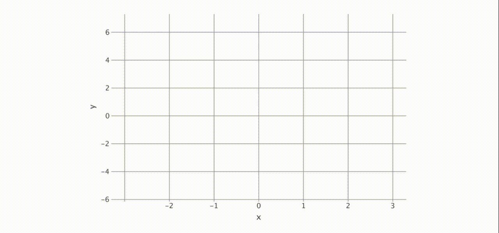

# Overview

<web-summary>
    Get introduced to Kandy, the powerful plotting library for Kotlin.
    Understand the philosophy driving its design, its standout features, and the motivations behind its creation.
</web-summary>
<card-summary>
    Dive into Kandy's philosophy, core features, and what makes it a unique choice for plotting in Kotlin.
</card-summary>
<link-summary>
    Kandy Unveiled: Philosophy, Features, and Motivations.
</link-summary>

## What is Kandy?



Kandy is an open-source data visualization library designed for Kotlin.
It adopts a modern approach to data visualization, offering an idiomatic and flexible DSL.
This DSL, integrating seamlessly with Kotlin's type safety, facilitates quick graph creation with fewer exceptions.
Kandy also supports various popular engines, enhancing its versatility and performance for efficient chart-building.

Kandy utilizes the [Lets-Plot library](https://github.com/JetBrains/lets-plot-kotlin),
which allows it to display in interactive notebooks,
saved as standalone _HTML_ files, and export in formats like _PNG_, _SVG_, and _JPEG_.
This capability enables the use of Kandy in [Kotlin projects](Kandy-with-Gradle.md).

Alongside `kandy-lets-plot`, there is an ongoing development of `kandy-echarts`,
an experimental module utilizing [`echarts.js`](https://echarts.apache.org/en/index.html) for rendering.

## Features

* _**Hierarchical DSL**_ — Provides an intuitive and straightforward approach to constructing graphs.
* _**Support for Kotlin notebooks**_ — Facilitates working with Kandy on platforms like
  IntelliJ IDEA with the
  [{style="inline" width="20"} Kotlin Notebook plugin](Kandy-in-Kotlin-Notebook.md),
  [{style="inline" width="22"} Datalore](Kandy-in-Datalore.md),
  and [{style="inline" width="24"} Jupyter Notebook](Kandy-in-Jupyter-Notebook.md).
* _**Swing rendering in Kotlin notebook**_ — Available in IntelliJ IDEA.
* _**Interactive tooltips**_ — Offers dynamic tooltips during rendering in both Swing and HTML.
* _**Kotlin collections support**_ — Seamlessly works with Kotlin’s standard collections as data sources.
* _**Kotlin DataFrame support**_ — Integrates with [Kotlin DataFrame](https://kotlin.github.io/dataframe/overview.html),
  utilizing generated extension properties and hierarchical data for plot construction.
* _**Type and null safety**_ — Ensures type safety and Kotlin null safety.

## DSL and Syntax

Kandy features a common API that facilitates the Plot Intermediate Representation (IR).
Both `kandy-lets-plot` and `kandy-echarts` are developed to be compatible with this API.

Kandy's DSL offers an intuitive, hierarchical approach to creating data visualizations.
Its flexible yet structured design is suitable for both beginners and experienced users.
Here's a simplified overview of the Kandy DSL structure:


* **Plot** — the `plot` block forms the foundation of every visualization in Kandy, setting the stage for all other
  elements.
* **Data Manipulation** — this block plays a key role in transforming the initial data utilized in `plot`.
    * **Grouping** — this method groups data according to specified keys,
      allowing for organized and structured visualization based on distinct data segments.
    * **Statistical** — this set of methods applies statistical operations to the data,
      producing new datasets derived from these computations.
* **Layout** — this part deals with the graph's design, including elements like titles, subtitles, size,
  and thematic elements.
* **Layers** — it introduces different types of visual elements, such as lines, points, bars, etc.
* **<tooltip term="aes">Aesthetic</tooltip> Mappings / Settings** —
  This feature enables mapping data attributes to visual properties like color,
  shape, and size, offering extensive customization options.
* **Scale Specification** — this aspect is crucial for translating data values into appropriate visual scales on the
  graph, including settings for color gradients, size ranges, and positioning.

Kandy's DSL offers a straightforward path for creating visualizations, combining clarity
and <tooltip term="aes">aesthetic</tooltip> appeal.
Its design focuses on ease of use, enabling the efficient crafting of complex charts.

### Syntax

Kandy's API follows the structure outlined below:

* Basic plotting with initial data:

```
plot(data) {
    // layer (geoms)
    line[bars | points | area | pie | ...] {
        ... // aesthetics     
    }

    line[bars | points | area | pie | ...] {
        ...
    }

      ...
}
```

* Transforming data into plotting context:

```
plot(data) {
    // data manipulation
    groupBy(Strings| Columns) [statBin|statBoxplot|statDensity|...] {
        line[bars | points | area | pie | ...] {
            ...
        }
        line[bars | points | area | pie | ...] {
            ...
        }

      ...
    }
}
```

* Combining original and transformed data:

```
plot(data) {
    groupBy(Strings| Columns) [statBin|statBoxplot|statDensity|...] {
        line[bars | points | area | pie | ...] {
            ...
        }
        line[bars | points | area | pie | ...] {
            ...
        }
      ...
    }

    line[bars | points | area | pie | ...] {
        ...
    }
    line[bars | points | area | pie | ...] {
        ...
    }

      ...
}
```

* Modifying plot layout:

```
plot(data) {
    line[bars | points | area | pie | ...] {
        ...
    }
      ...

    layout {
        title
        subtitle
          ...
        theme { ... }
        legend { ... }
        grid { ... }
          ...
    }
}
```

For mappings and settings, Kandy uses the following approach:

* Mapping to a _Collection_ or _Column_ is done through function calls:

```kotlin
x("time") // map to the column `time`
y(listOf(1, 2, 3)) // map to a list
color(type) // map to the type column
```

* Settings for <tooltip term="posAes">positional aesthetics</tooltip>:

```kotlin
x.constant(3)
yIntercept.constant(5.7)
```

* Settings for other <tooltip term="aes">aesthetics</tooltip>:

```kotlin
color = Color.RED
size = 4.5
type = LineType.DASHED
```

Now that we've covered Kandy's DSL components and structure, let's see how they work together in a practical example.
This demonstrates the DSL's capability in crafting a visualization with ease and flexibility:

<!---IMPORT org.jetbrains.kotlinx.kandy.letsplot.samples.QuickStart-->

<!---FUN quickstart_sample-->
<!---END-->

 { border-effect="rounded" }

More examples of working with the library can be found [here](Examples.topic).
