# Examples of Kandy

To get started with the library,
we suggest referring to the cheatsheet which covers the fundamental aspects and features.

<table style="border-collapse: collapse; border: none;">
  <tr style="border: none;">
    <td style="border: none;">
      <b>Geoms</b>
      <ul>
        <li>algebraic_curve</li>
        <li>error_bars</li>
      </ul>
    </td>
    <td style="border: none;">
      <b>Statistical</b>
      <ul>
        <li>statistics</li>
        <li>smoothing</li>
      </ul>
    </td>
  </tr>
</table>

            <iframe src='about:blank' style='border:none !important;' width='700' height='450' srcdoc="&lt;html lang=&quot;en&quot;>
&lt;head>
&lt;meta charset=&quot;UTF-8&quot;>
&lt;style> html, body { margin: 0; overflow: hidden; } &lt;/style>
&lt;script type=&quot;text/javascript&quot; data-lets-plot-script=&quot;library&quot; src=&quot;https://cdn.jsdelivr.net/gh/JetBrains/lets-plot@v4.1.0/js-package/distr/lets-plot.min.js&quot;>&lt;/script>
&lt;/head>
&lt;body>
&lt;div id=&quot;6YRgIL&quot;>&lt;/div>
&lt;script type=&quot;text/javascript&quot; data-lets-plot-script=&quot;plot&quot;>
var plotSpec={
&quot;ggtitle&quot;:{
&quot;text&quot;:&quot;Simple plot with kandy-lets-plot&quot;
},
&quot;mapping&quot;:{
},
&quot;data&quot;:{
&quot;temperature&quot;:[12.0,14.2,15.1,15.9,17.9,15.6,14.2,24.3],
&quot;humidity&quot;:[0.5,0.32,0.11,0.89,0.68,0.57,0.56,0.5],
&quot;time&quot;:[0.0,1.0,2.0,4.0,5.0,7.0,8.0,9.0]
},
&quot;ggsize&quot;:{
&quot;width&quot;:700.0,
&quot;height&quot;:450.0
},
&quot;kind&quot;:&quot;plot&quot;,
&quot;scales&quot;:[{
&quot;aesthetic&quot;:&quot;x&quot;,
&quot;limits&quot;:[null,null]
},{
&quot;aesthetic&quot;:&quot;y&quot;,
&quot;limits&quot;:[0.0,25.5]
},{
&quot;aesthetic&quot;:&quot;fill&quot;,
&quot;scale_mapper_kind&quot;:&quot;color_gradient&quot;,
&quot;high&quot;:&quot;#ee6666&quot;,
&quot;low&quot;:&quot;#fac858&quot;,
&quot;limits&quot;:[null,null]
},{
&quot;aesthetic&quot;:&quot;x&quot;,
&quot;limits&quot;:[null,null]
},{
&quot;aesthetic&quot;:&quot;y&quot;,
&quot;limits&quot;:[0.0,25.5]
}],
&quot;layers&quot;:[{
&quot;mapping&quot;:{
&quot;x&quot;:&quot;time&quot;,
&quot;y&quot;:&quot;temperature&quot;,
&quot;fill&quot;:&quot;humidity&quot;
},
&quot;stat&quot;:&quot;identity&quot;,
&quot;size&quot;:0.0,
&quot;sampling&quot;:&quot;none&quot;,
&quot;position&quot;:&quot;dodge&quot;,
&quot;geom&quot;:&quot;bar&quot;,
&quot;data&quot;:{
}
},{
&quot;mapping&quot;:{
&quot;x&quot;:&quot;time&quot;,
&quot;y&quot;:&quot;temperature&quot;
},
&quot;stat&quot;:&quot;identity&quot;,
&quot;size&quot;:3.0,
&quot;color&quot;:&quot;#6e5596&quot;,
&quot;linetype&quot;:&quot;dotdash&quot;,
&quot;sampling&quot;:&quot;none&quot;,
&quot;position&quot;:&quot;identity&quot;,
&quot;geom&quot;:&quot;line&quot;,
&quot;data&quot;:{
}
}],
&quot;caption&quot;:{
&quot;text&quot;:&quot;See `examples` section for more\n complicated and interesting examples!&quot;
}
};
var plotContainer = document.getElementById(&quot;6YRgIL&quot;);
LetsPlot.buildPlotFromProcessedSpecs(plotSpec, -1, -1, plotContainer);
&lt;/script>
&lt;/body>
&lt;/html>"></iframe>

### Lets-Plot Cheatsheet

<table>
    <tr>
        <td>
            <a href="notebooks/lets-plot/guides/quick_start_guide.ipynb">Notebook</a>/<a href="https://datalore.jetbrains.com/report/static/KQKedA4jDrKu63O53gEN0z/TKul6gxAVDbJmocwQi9UjB">Datalore</a>
        </td>
        <td>
            <a href="notebooks/lets-plot/guides/quick_start_guide.ipynb">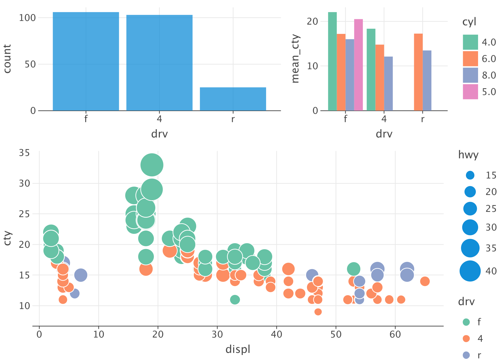</a>
        </td>
    </tr>
</table>

### Echarts Cheatsheet

<table>
    <tr>
        <td>
            <a href="notebooks/echarts/echarts_cheatsheet.ipynb">Notebook</a>/<a href="https://datalore.jetbrains.com/view/notebook/kCKb37O2P9ZYEHGPnOZc9r">Datalore</a>
        </td>
        <td>
            <a href="notebooks/echarts/echarts_cheatsheet.ipynb">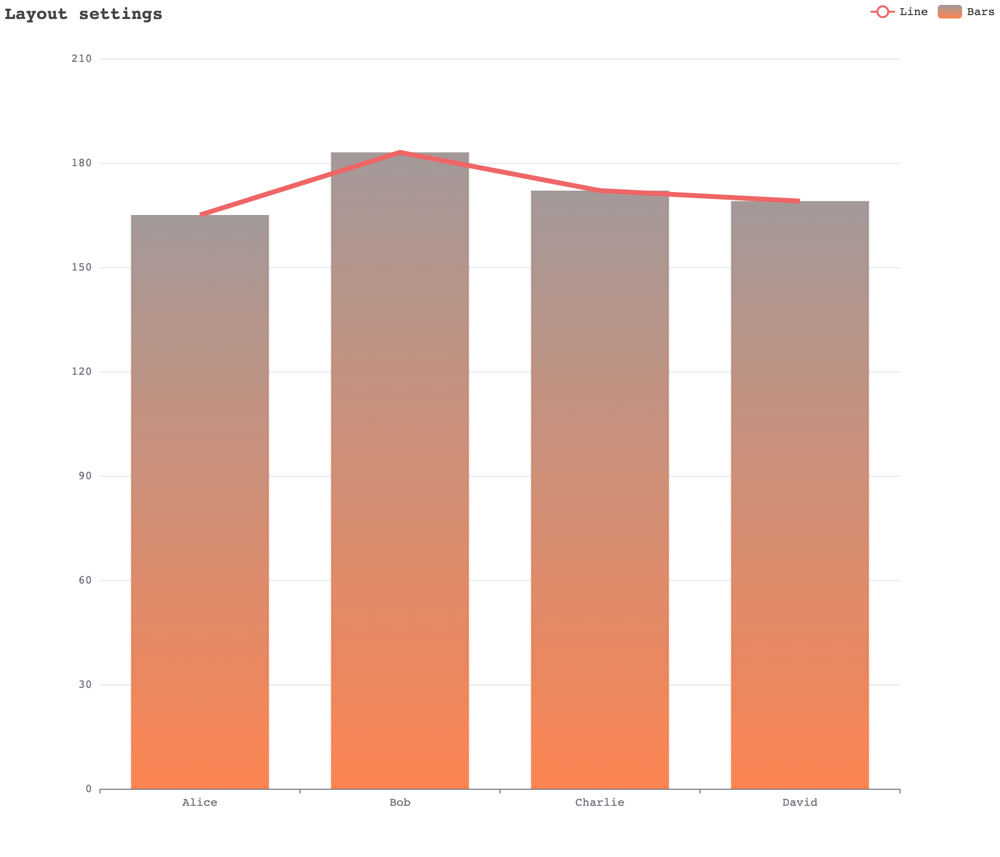</a>
        </td>
    </tr>
</table>

## Table of Contents

<!--- TOC -->

* [IDEA Examples](#idea-examples)

* [Notebook Examples](#notebook-examples)

    * [Lets-Plot Examples](#lets-plot-examples)

    * [Echarts Examples](#echarts-examples)

<!--- END -->

## IDEA examples

[**lets-plot-simple
**](idea-examples/lets-plot-simple/src/main/kotlin/org/jetbrains/kotlinx/kandy/letsplot/simple_lets_plot.kt) —

The following is an example of using the `kandy-lets-plot` library in an IntelliJ IDEA project.

___

[**echarts-simple
**](idea-examples/echarts-simple/src/main/kotlin/org/jetbrains/kotlinx/kandy/echarts/simple_echarts.kt) —

The following is an example of using the `kandy-echarts` library in an IntelliJ IDEA project.

## Notebook examples

### Lets-Plot Examples

#### Line

<table>
    <tr>
        <td>
            
This notebook covers everything you need to work with `line` plots.

            <a href="notebooks/lets-plot/lines.ipynb">Notebook</a>/<a href="https://datalore.jetbrains.com/view/notebook/l9tr3GIjFZtsF03gvZb0jt">Datalore</a>
        </td>
        <td>
            <a href="notebooks/lets-plot/lines.ipynb">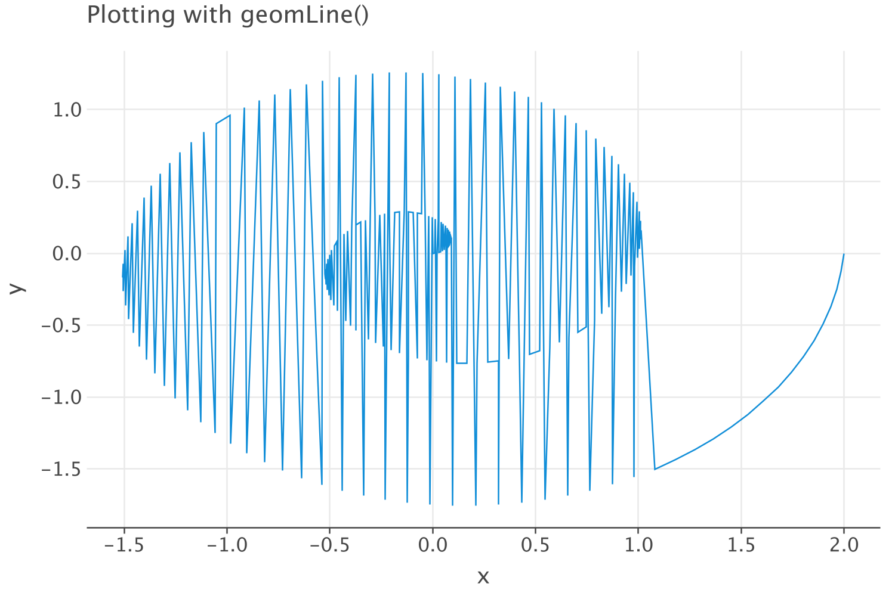</a>
        </td>
    </tr>
</table>

#### Scatter

<table>
    <tr>
        <td>
            
Here you will find how to work with `point` plots.

            <a href="notebooks/lets-plot/scatter_plot.ipynb">Notebook</a>/<a href="https://datalore.jetbrains.com/view/notebook/xqKxAjGJ6DKYh3hkBODokl">Datalore</a>
        </td>
        <td>
            
        </td>
    </tr>
</table>

#### Stats and Histogram

<table>
    <tr>
        <td>
            
This notebook covers basic work with `statistics` and `histograms`.

            <a href="notebooks/lets-plot/binstat_histogram.ipynb">Notebook</a>/<a href="https://datalore.jetbrains.com/view/notebook/JQ7nzqPmY0G4LdHccErRkP">Datalore</a>
        </td>
        <td>
            <a href="notebooks/lets-plot/binstat_histogram.ipynb">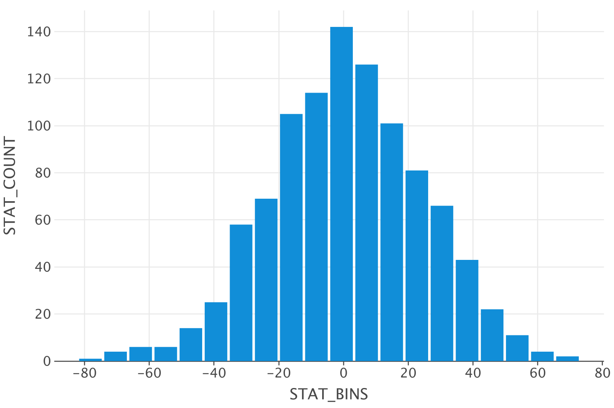</a>
        </td>
    </tr>
</table>

#### Error Bars

<table>
    <tr>
        <td>
            
Here you will learn how to work with plots known as `error bars`.

            <a href="notebooks/lets-plot/error_bars.ipynb">Notebook</a>/<a href="https://datalore.jetbrains.com/view/notebook/0oIfPyFmtyBOa9AceZi1ft">Datalore</a>
        </td>
        <td>
            
        </td>
    </tr>
</table>

#### Algebraic Curve

<table>
    <tr>
        <td>
            
This example plots an elliptic curve.

            <a href="notebooks/lets-plot/algebraic_curve.ipynb">Notebook</a>/<a href="https://datalore.jetbrains.com/view/notebook/BTOH6iKT0o8o7RKwdmb1U3">Datalore</a>
        </td>
        <td>
            <a href="notebooks/lets-plot/algebraic_curve.ipynb">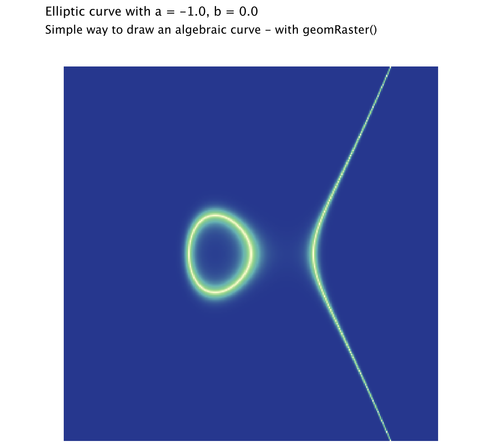</a>
        </td>
    </tr>
</table>

#### Jitter Points

<table>
    <tr>
        <td>
            
A simple example of building `jitter points`.

            <a href="notebooks/lets-plot/jitter_points.ipynb">Notebook</a>/<a href="https://datalore.jetbrains.com/view/notebook/i2WfipisdguG1eHYio9EbY">Datalore</a>
        </td>
        <td>
            <a href="notebooks/lets-plot/jitter_points.ipynb">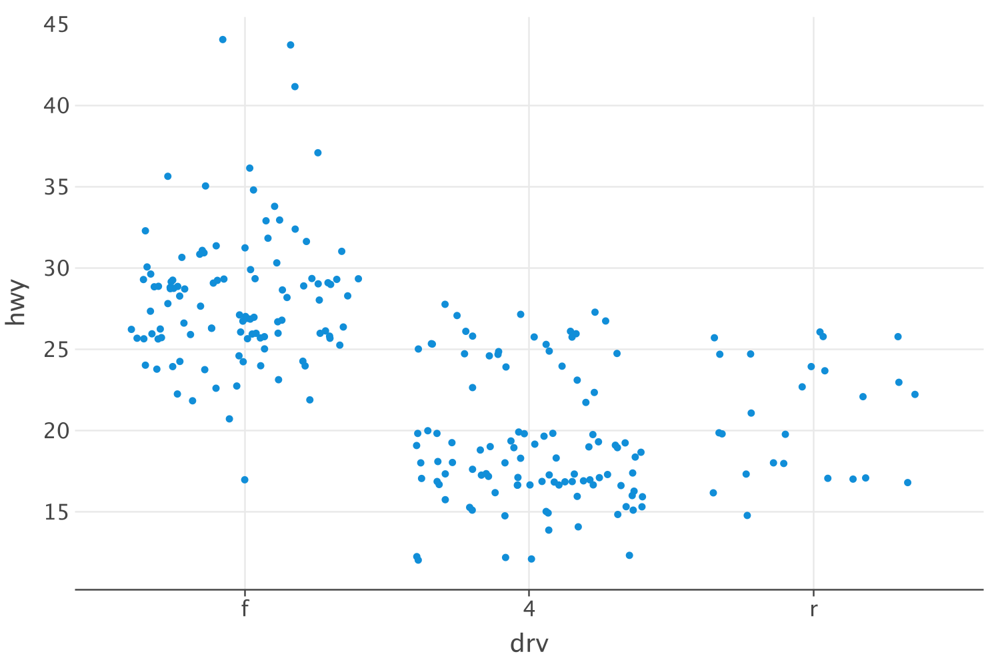</a>
        </td>
    </tr>
</table>

#### Ribbon

<table>
    <tr>
        <td>
            
Example of building a `ribbon`.

            <a href="notebooks/lets-plot/ribbon.ipynb">Notebook</a>/<a href="https://datalore.jetbrains.com/view/notebook/w0TFVkKNVK4tFKYVhvaccm">Datalore</a>
        </td>
        <td>
            <a href="notebooks/lets-plot/ribbon.ipynb">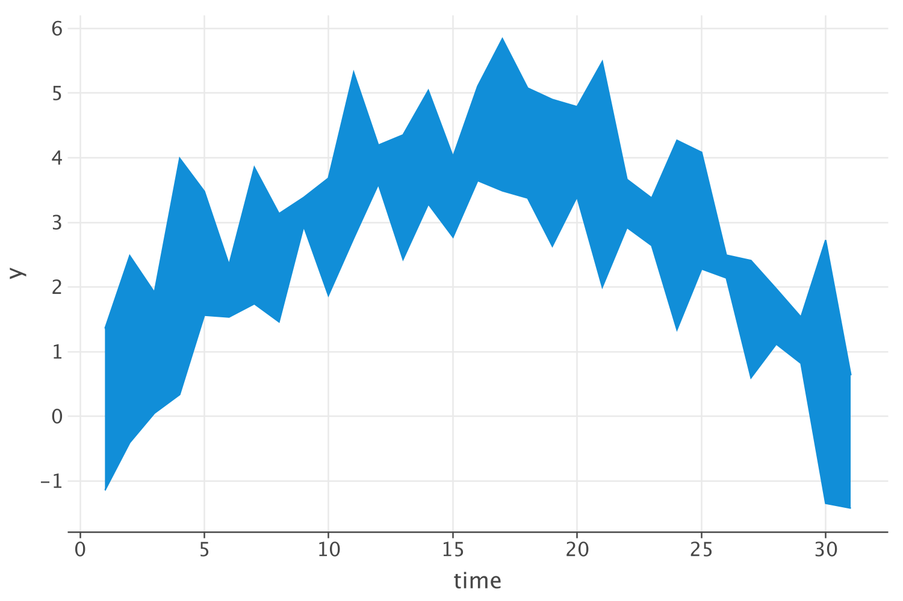</a>
        </td>
    </tr>
</table>

#### Facets

<table>
    <tr>
        <td>
            
If you want to build a matrix of panel plots, you can use the `facet`, and in this example, you will learn how to work with it.

            <a href="notebooks/lets-plot/facets.ipynb">Notebook</a>/<a href="https://datalore.jetbrains.com/view/notebook/mtEsSYfcU4X0S37AMCM8Ws">Datalore</a>
        </td>
        <td>
            <a href="notebooks/lets-plot/facets.ipynb">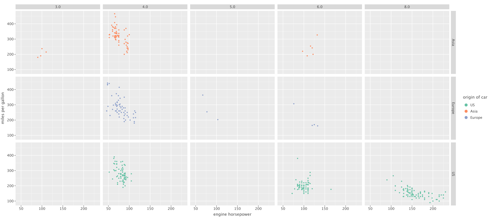</a>
        </td>
    </tr>
</table>

___

<table>
    <tr>
        <td>
            
Also, this notebook will help you work with `free scales` and `facet`.

            <a href="notebooks/lets-plot/facets_free_scales.ipynb">Notebook</a>/<a href="https://datalore.jetbrains.com/view/notebook/soZpIeVYbJV3EoJCz0DCJL">Datalore</a>
        </td>
        <td>
            <a href="notebooks/lets-plot/facets_free_scales.ipynb">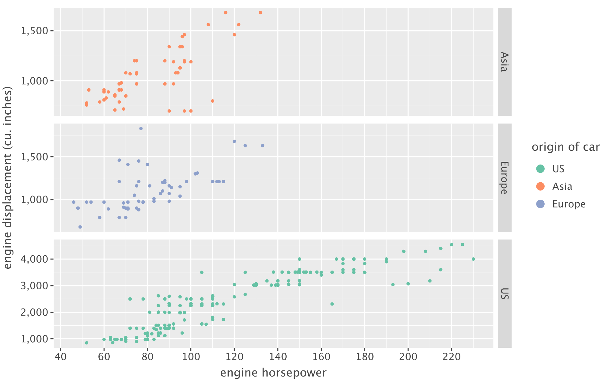</a>
        </td>
    </tr>
</table>

#### Plot Bunch

<table>
    <tr>
        <td>
            
If you want to display multiple plots in one output, you can use `plotBunch`, and you can learn about it here.

            <a href="notebooks/lets-plot/plot_bunch.ipynb">Notebook</a>/<a href="https://datalore.jetbrains.com/view/notebook/5QBS2btBdnPq3Ia4CNb4Px">Datalore</a>
        </td>
        <td>
            <a href="notebooks/lets-plot/plot_bunch.ipynb">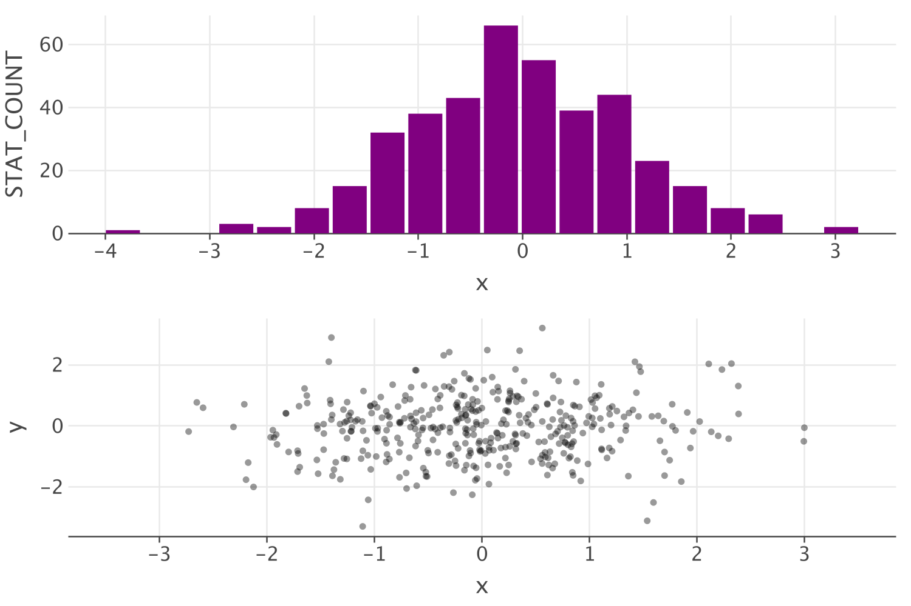</a>
        </td>
    </tr>
</table>

#### Legend and Axis

<table>
    <tr>
        <td>
            
Customizing the `legend` and `axes`.

            <a href="notebooks/lets-plot/legend_and_axis.ipynb">Notebook</a>/<a href="https://datalore.jetbrains.com/view/notebook/m4XQAzyDqS1uzzE56XBKDR">Datalore</a>
        </td>
        <td>
            <a href="notebooks/lets-plot/legend_and_axis.ipynb">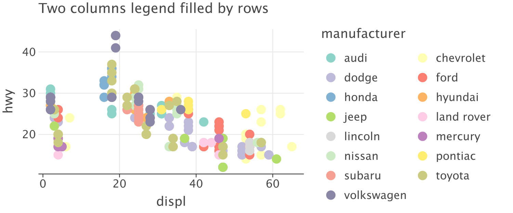</a>
        </td>
    </tr>
</table>

#### Titles

<table>
    <tr>
        <td>
            
Everything related to `titles`, `subtitles`, and `captions`.

            <a href="notebooks/lets-plot/title_subtitle_caption.ipynb">Notebook</a>/<a href="https://datalore.jetbrains.com/view/notebook/lHYmEXJHNrKWmcTdU8z2rC">Datalore</a>
        </td>
        <td>
            <a href="notebooks/lets-plot/title_subtitle_caption.ipynb">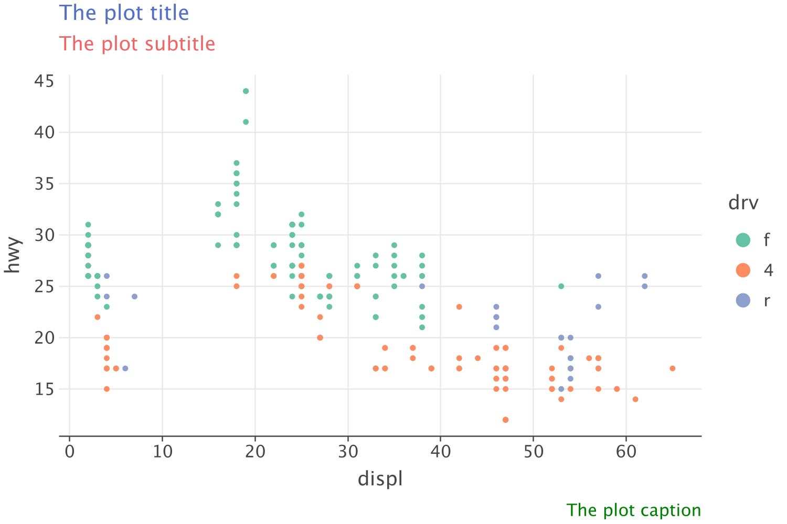</a>
        </td>
    </tr>
</table>

#### Tooltips

<table>
    <tr>
        <td>
            
<b>Tooltip settings</b>

            <a href="notebooks/lets-plot/tooltip_config.ipynb">Notebook</a>/<a href="https://datalore.jetbrains.com/view/notebook/Yz9XXpdunbd23jL7aLxAlx">Datalore</a>
        </td>
        <td>
            <a href="notebooks/lets-plot/tooltip_config.ipynb">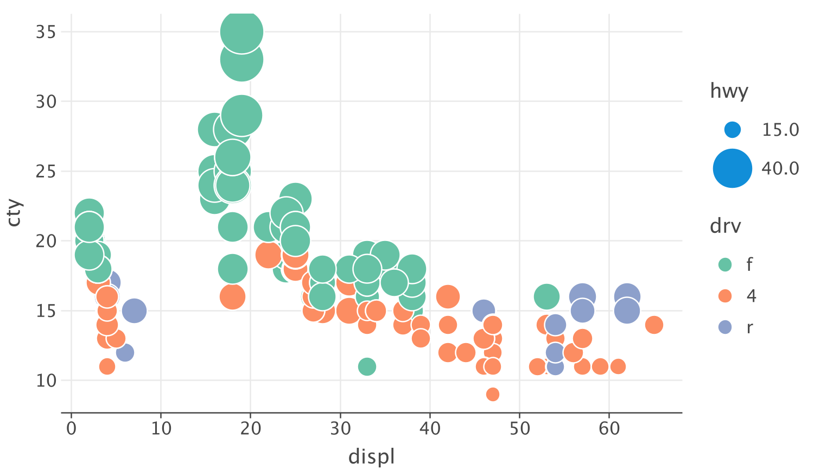</a>
        </td>
    </tr>
    <tr>
        <td>
            
<b>Tooltip labels</b>

            <a href="notebooks/lets-plot/tooltip_title.ipynb">Notebook</a>/<a href="https://datalore.jetbrains.com/view/notebook/VyVuqcDEhvjfRGPJNWKYQn">Datalore</a>
        </td>
    </tr>
    <tr>
        <td>
            
<b>Tooltip themes</b>

            <a href="notebooks/lets-plot/tooltips_theme.ipynb">Notebook</a>/<a href="https://datalore.jetbrains.com/view/notebook/QMZuOW6397gbRn0PRSPjM3">Datalore</a>
        </td>
    </tr>
</table>

#### Themes

<table>
    <tr>
        <td>
            
You can change the themes of your plot, and here is how you can do it.

            <a href="notebooks/lets-plot/themes.ipynb">Notebook</a>/<a href="https://datalore.jetbrains.com/view/notebook/bSOcGvMRbHhDvSpWvQ0vzZ">Datalore</a>
        </td>
        <td>
            <a href="notebooks/lets-plot/themes.ipynb">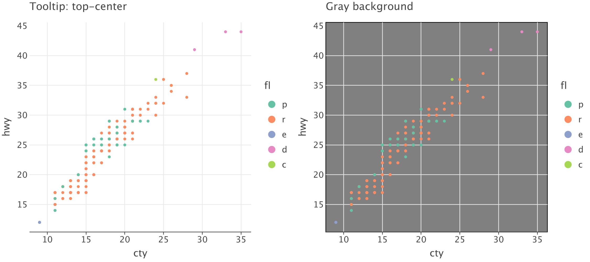</a>
        </td>
    </tr>
</table>

#### Kotlin Notebook Features

<table>
    <tr>
        <td>
            
This notebook covers features that work only in
<a href="https://plugins.jetbrains.com/plugin/16340-kotlin-notebook">Kotlin Notebook.</a>

            <a href="notebooks/lets-plot/kotlin_notebook_features.ipynb">Notebook</a>/<a href="">Datalore</a>
        </td>
        <td>
            <a href="notebooks/lets-plot/kotlin_notebook_features.ipynb">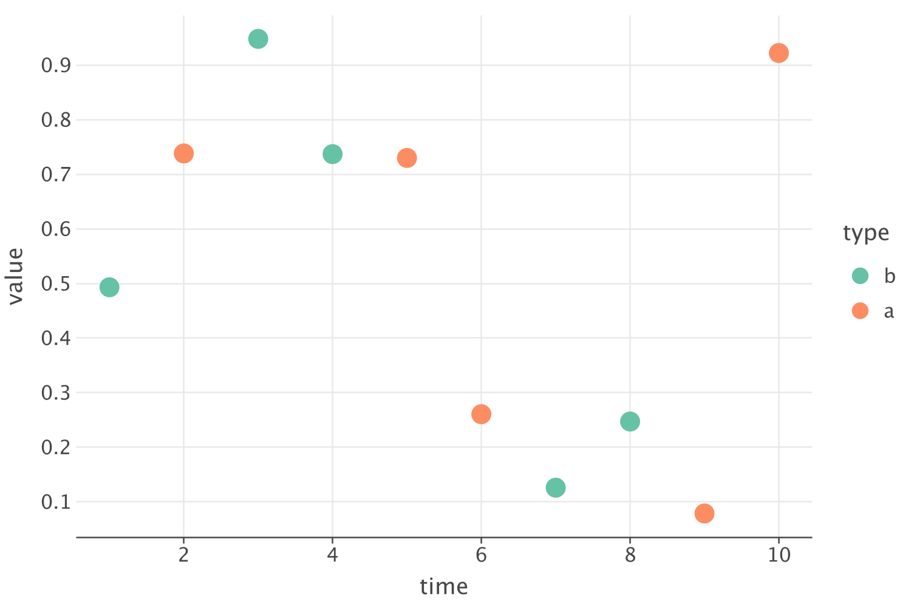</a>
        </td>
    </tr>
</table>

### Echarts Examples

#### Line

<table>
    <tr>
        <td>
            <a href="notebooks/echarts/lines.ipynb">Notebook</a>/<a href="https://datalore.jetbrains.com/view/notebook/S3c9VeDQQe7P8cxK4cGU3I">Datalore</a>
        </td>
        <td>
            <a href="notebooks/echarts/lines.ipynb">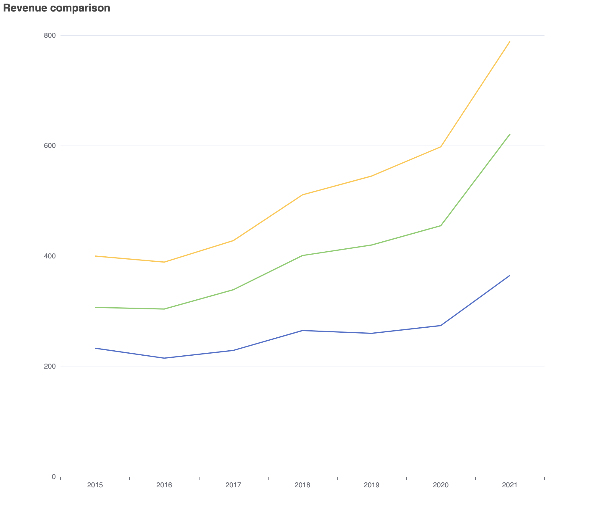</a>
        </td>
    </tr>
</table>

#### Area

<table>
    <tr>
        <td>
            <a href="notebooks/echarts/areas.ipynb">Notebook</a>/<a href="https://datalore.jetbrains.com/view/notebook/zN1Y7cq5xod3mVd61JFmcH">Datalore</a>
        </td>
        <td>
            <a href="notebooks/echarts/areas.ipynb">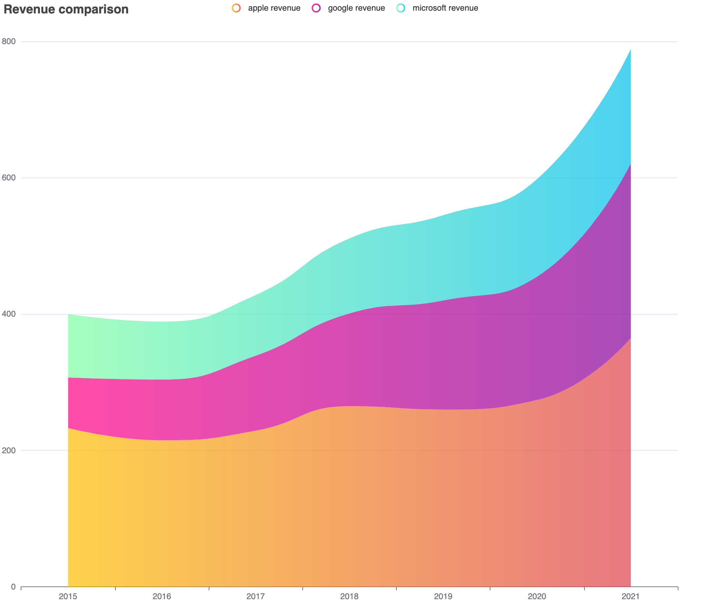</a>
        </td>
    </tr>
</table>

#### Bar

<table>
    <tr>
        <td>
            <a href="notebooks/echarts/bars.ipynb">Notebook</a>/<a href="https://datalore.jetbrains.com/view/notebook/SyoHzSRWjrS5GH3ptM1Hqb">Datalore</a>
        </td>
        <td>
            <a href="notebooks/echarts/bars.ipynb">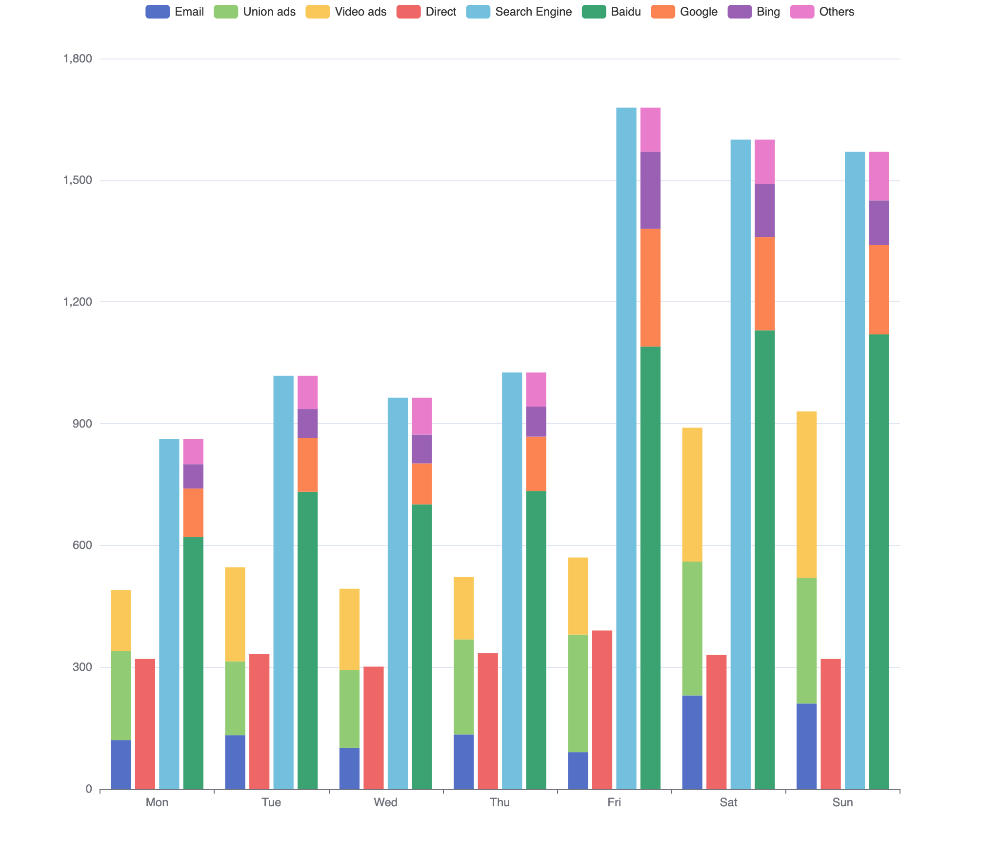</a>
        </td>
    </tr>
</table>

#### Point

<table>
    <tr>
        <td>
            <a href="notebooks/echarts/points.ipynb">Notebook</a>/<a href="https://datalore.jetbrains.com/view/notebook/UT2PGyWS9nQvwwuh9KmSFM">Datalore</a>
        </td>
        <td>
            <a href="notebooks/echarts/points.ipynb">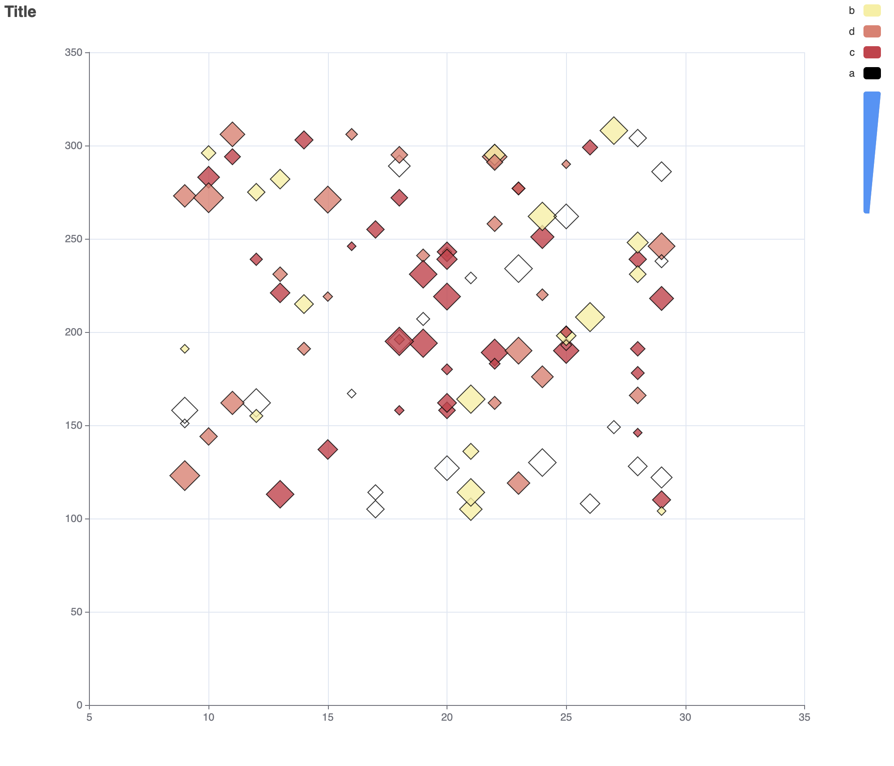</a>
        </td>
    </tr>
</table>

#### Marks

<table>
    <tr>
        <td>
            <a href="notebooks/echarts/marks.ipynb">Notebook</a>/<a href="https://datalore.jetbrains.com/view/notebook/GXPihGhWJEwSHFI7RXneJx">Datalore</a>
        </td>
        <td>
            
        </td>
    </tr>
</table>
