# Examples of Kandy

## User Guide

* **Quick Start Guide** - Notebook / Datalore
* **Geoms**
    * algebraic_curve - Notebook / Datalore
    * error_bars - Notebook / Datalore
    * jitter_points - Notebook / Datalore
    * lines - Notebook / Datalore
    * pie - Notebook / Datalore
    * ribbon - Notebook / Datalore
    * scatter_plot - Notebook / Datalore
* **Statistical**
    * statistics - Notebook / Datalore
    * smoothing - Notebook / Datalore
    * histogram - Notebook / Datalore
    * boxplot - Notebook / Datalore
    * heatmap - Notebook / Datalore
    * countPlot - Notebook / Datalore
    * densityPlot - Notebook / Datalore
* **Multiplot**
    * anscombes_quartet
    * facets
    * plot_bunch
* **Layout customization**
    * label_format - Notebook / Datalore
    * legend_and_axis - Notebook / Datalore
    * themes - Notebook / Datalore
    * title_subtitle_caption - Notebook / Datalore
    * tooltips - Notebook / Datalore
* **Other guides**
    * export_to_file
    * kotlin_notebook_features
    * series_hack

## IDEA examples

[**lets-plot-simple
**](idea-examples/lets-plot-simple/src/main/kotlin/org/jetbrains/kotlinx/kandy/letsplot/simple_lets_plot.kt) —

The following is an example of using the `kandy-lets-plot` library in an IntelliJ IDEA project.

___

[**echarts-simple
**](idea-examples/echarts-simple/src/main/kotlin/org/jetbrains/kotlinx/kandy/echarts/simple_echarts.kt) —

The following is an example of using the `kandy-echarts` library in an IntelliJ IDEA project.

## Notebook Examples

### Line

<table>
    <tr>
        <td>
            <a href="https://kotlin.github.io/kandy/simple-line.html">
                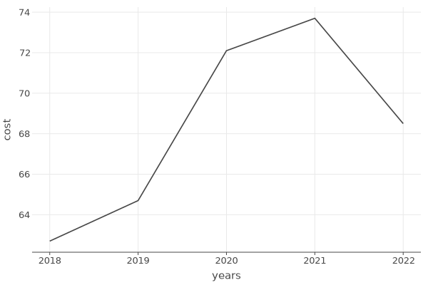
                <b>Simple Line</b>
            </a>
        </td>
        <td>
            <a href="https://kotlin.github.io/kandy/line-settings.html">
                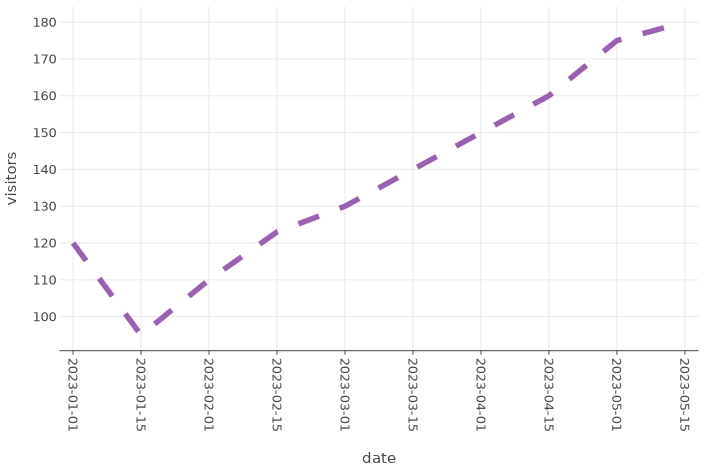
                <b>Line Settings</b>
            </a>
        </td>
        <td>
            <a href="https://kotlin.github.io/kandy/line-with-points.html">
                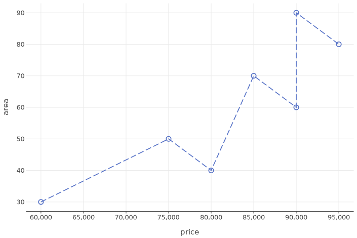
                <b>Line with Points</b>
            </a>
        </td>
    </tr>
    <tr>
        <td>
            <a href="https://kotlin.github.io/kandy/fixed-line-coordinate.html">
                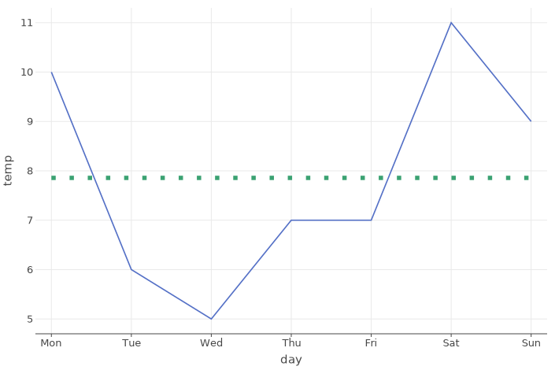
                <b>Fixed Line Coordinate</b>
            </a>
        </td>
        <td>
            <a href="https://kotlin.github.io/kandy/line-gradient.html">
                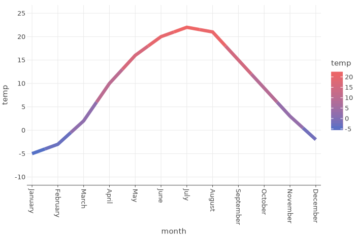
                <b>Line Gradient</b>
            </a>
        </td>
        <td>
            <a href="https://kotlin.github.io/kandy/line-with-reversed-axis.html">
                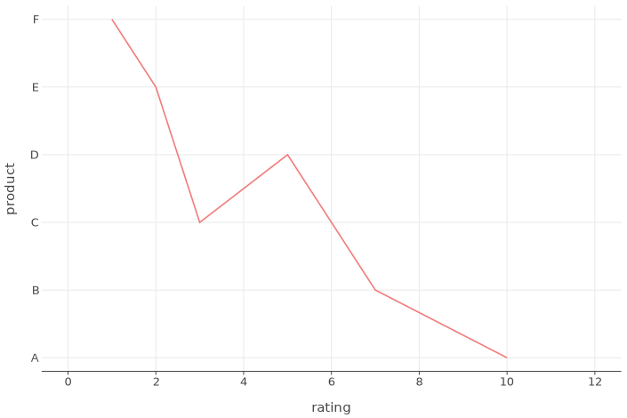
                <b>Line with Reversed Axis</b>
            </a>
        </td>
    </tr>
    <tr>
        <td>
            <a href="https://kotlin.github.io/kandy/several-lines.html">
                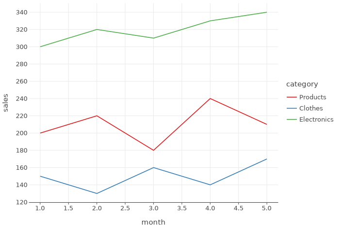
                <b>Several Lines</b>
            </a>
        </td>
        <td>
            <a href="https://kotlin.github.io/kandy/functional-line-plot.html">
                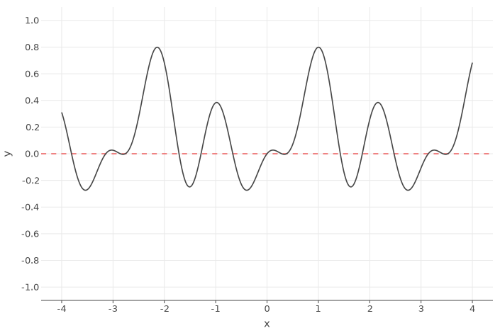
                <b>Functional Line Plot</b>
            </a>
        </td>
        <td>
            <a href="https://kotlin.github.io/kandy/marked-line.html">
                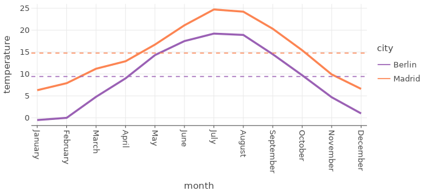
                <b>Marked Line</b>
            </a>
        </td>
    </tr>
    <tr>
        <td>
            <a href="https://kotlin.github.io/kandy/path-line.html">
                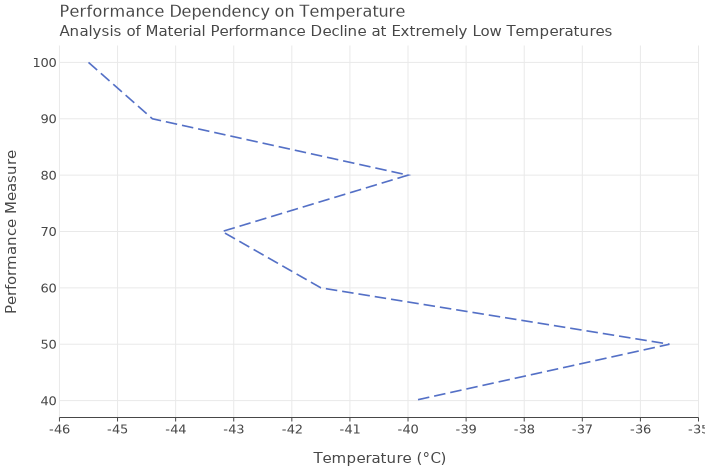
                <b>Path Line</b>
            </a>
        </td>
        <td>
            <a href="https://kotlin.github.io/kandy/step-line.html">
                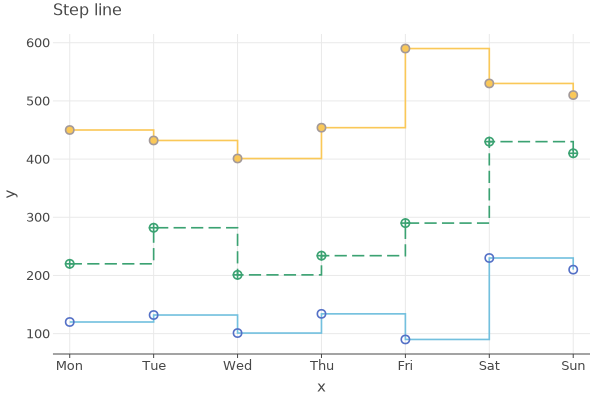
                <b>Step Line</b>
            </a>
        </td>
        <td>
            <a href="https://kotlin.github.io/kandy/smoothed-line.html">
                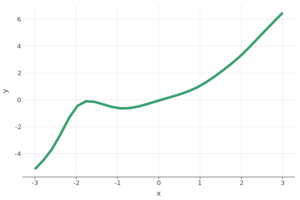
                <b>Smoothed Line</b>
            </a>
        </td>
    </tr>
    <tr>
        <td>
            <a href="https://kotlin.github.io/kandy/smoothed-curve-with-points.html">
                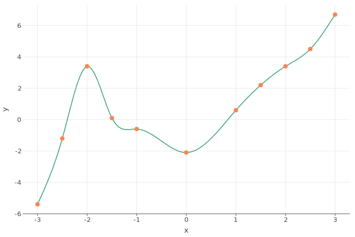
                <b>Smoothed Curve with Points</b>
            </a>
        </td>
        <td>
            <a href="https://kotlin.github.io/kandy/comparing-line-vs-path-plots.html">
                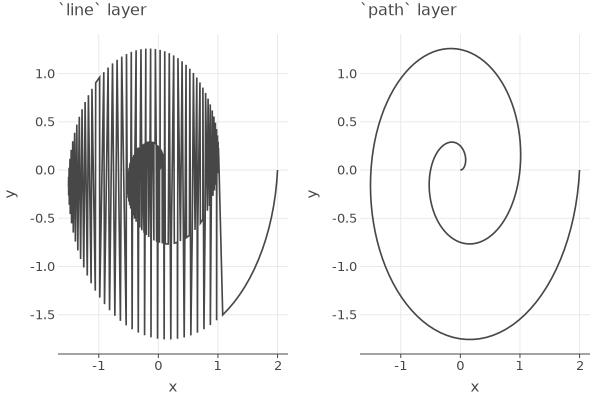
                <b>Comparing Line vs. Path Plots</b>
            </a>
        </td>
    </tr>
</table>

### Area

### Bars

### Points

### Error Bars

### Boxplot

### Tiles

### Lets-Plot Cheatsheet

<table>
    <tr>
        <td>
            <a href="notebooks/lets-plot/guides/quick_start_guide.ipynb">Notebook</a>/<a href="https://datalore.jetbrains.com/report/static/KQKedA4jDrKu63O53gEN0z/TKul6gxAVDbJmocwQi9UjB">Datalore</a>
        </td>
        <td>
            
        </td>
    </tr>
</table>

### Echarts Cheatsheet

<table>
    <tr>
        <td>
            <a href="notebooks/echarts/echarts_cheatsheet.ipynb">Notebook</a>/<a href="https://datalore.jetbrains.com/view/notebook/kCKb37O2P9ZYEHGPnOZc9r">Datalore</a>
        </td>
        <td>
            
        </td>
    </tr>
</table>

## Table of Contents

<!--- TOC -->

* [IDEA Examples](#idea-examples)

* [Notebook Examples](#notebook-examples)

    * [Lets-Plot Examples](#lets-plot-examples)

    * [Echarts Examples](#echarts-examples)

<!--- END -->

## Notebook examples

### Lets-Plot Examples

#### Line

<table>
    <tr>
        <td>
            
This notebook covers everything you need to work with `line` plots.

            <a href="notebooks/lets-plot/lines.ipynb">Notebook</a>/<a href="https://datalore.jetbrains.com/view/notebook/l9tr3GIjFZtsF03gvZb0jt">Datalore</a>
        </td>
        <td>
            
        </td>
    </tr>
</table>

#### Scatter

<table>
    <tr>
        <td>
            
Here you will find how to work with `point` plots.

            <a href="notebooks/lets-plot/scatter_plot.ipynb">Notebook</a>/<a href="https://datalore.jetbrains.com/view/notebook/xqKxAjGJ6DKYh3hkBODokl">Datalore</a>
        </td>
        <td>
            
        </td>
    </tr>
</table>

#### Stats and Histogram

<table>
    <tr>
        <td>
            
This notebook covers basic work with `statistics` and `histograms`.

            <a href="notebooks/lets-plot/binstat_histogram.ipynb">Notebook</a>/<a href="https://datalore.jetbrains.com/view/notebook/JQ7nzqPmY0G4LdHccErRkP">Datalore</a>
        </td>
        <td>
            
        </td>
    </tr>
</table>

#### Error Bars

<table>
    <tr>
        <td>
            
Here you will learn how to work with plots known as `error bars`.

            <a href="notebooks/lets-plot/error_bars.ipynb">Notebook</a>/<a href="https://datalore.jetbrains.com/view/notebook/0oIfPyFmtyBOa9AceZi1ft">Datalore</a>
        </td>
        <td>
            
        </td>
    </tr>
</table>

#### Algebraic Curve

<table>
    <tr>
        <td>
            
This example plots an elliptic curve.

            <a href="notebooks/lets-plot/algebraic_curve.ipynb">Notebook</a>/<a href="https://datalore.jetbrains.com/view/notebook/BTOH6iKT0o8o7RKwdmb1U3">Datalore</a>
        </td>
        <td>
            
        </td>
    </tr>
</table>

#### Jitter Points

<table>
    <tr>
        <td>
            
A simple example of building `jitter points`.

            <a href="notebooks/lets-plot/jitter_points.ipynb">Notebook</a>/<a href="https://datalore.jetbrains.com/view/notebook/i2WfipisdguG1eHYio9EbY">Datalore</a>
        </td>
        <td>
            
        </td>
    </tr>
</table>

#### Ribbon

<table>
    <tr>
        <td>
            
Example of building a `ribbon`.

            <a href="notebooks/lets-plot/ribbon.ipynb">Notebook</a>/<a href="https://datalore.jetbrains.com/view/notebook/w0TFVkKNVK4tFKYVhvaccm">Datalore</a>
        </td>
        <td>
            
        </td>
    </tr>
</table>

#### Facets

<table>
    <tr>
        <td>
            
If you want to build a matrix of panel plots, you can use the `facet`, and in this example, you will learn how to work with it.

            <a href="notebooks/lets-plot/facets.ipynb">Notebook</a>/<a href="https://datalore.jetbrains.com/view/notebook/mtEsSYfcU4X0S37AMCM8Ws">Datalore</a>
        </td>
        <td>
            
        </td>
    </tr>
</table>

___

<table>
    <tr>
        <td>
            
Also, this notebook will help you work with `free scales` and `facet`.

            <a href="notebooks/lets-plot/facets_free_scales.ipynb">Notebook</a>/<a href="https://datalore.jetbrains.com/view/notebook/soZpIeVYbJV3EoJCz0DCJL">Datalore</a>
        </td>
        <td>
            
        </td>
    </tr>
</table>

#### Plot Bunch

<table>
    <tr>
        <td>
            
If you want to display multiple plots in one output, you can use `plotBunch`, and you can learn about it here.

            <a href="notebooks/lets-plot/plot_bunch.ipynb">Notebook</a>/<a href="https://datalore.jetbrains.com/view/notebook/5QBS2btBdnPq3Ia4CNb4Px">Datalore</a>
        </td>
        <td>
            
        </td>
    </tr>
</table>

#### Legend and Axis

<table>
    <tr>
        <td>
            
Customizing the `legend` and `axes`.

            <a href="notebooks/lets-plot/legend_and_axis.ipynb">Notebook</a>/<a href="https://datalore.jetbrains.com/view/notebook/m4XQAzyDqS1uzzE56XBKDR">Datalore</a>
        </td>
        <td>
            
        </td>
    </tr>
</table>

#### Titles

<table>
    <tr>
        <td>
            
Everything related to `titles`, `subtitles`, and `captions`.

            <a href="notebooks/lets-plot/title_subtitle_caption.ipynb">Notebook</a>/<a href="https://datalore.jetbrains.com/view/notebook/lHYmEXJHNrKWmcTdU8z2rC">Datalore</a>
        </td>
        <td>
            
        </td>
    </tr>
</table>

#### Tooltips

<table>
    <tr>
        <td>
            
<b>Tooltip settings</b>

            <a href="notebooks/lets-plot/tooltip_config.ipynb">Notebook</a>/<a href="https://datalore.jetbrains.com/view/notebook/Yz9XXpdunbd23jL7aLxAlx">Datalore</a>
        </td>
        <td>
            
        </td>
    </tr>
    <tr>
        <td>
            
<b>Tooltip labels</b>

            <a href="notebooks/lets-plot/tooltip_title.ipynb">Notebook</a>/<a href="https://datalore.jetbrains.com/view/notebook/VyVuqcDEhvjfRGPJNWKYQn">Datalore</a>
        </td>
    </tr>
    <tr>
        <td>
            
<b>Tooltip themes</b>

            <a href="notebooks/lets-plot/tooltips_theme.ipynb">Notebook</a>/<a href="https://datalore.jetbrains.com/view/notebook/QMZuOW6397gbRn0PRSPjM3">Datalore</a>
        </td>
    </tr>
</table>

#### Themes

<table>
    <tr>
        <td>
            
You can change the themes of your plot, and here is how you can do it.

            <a href="notebooks/lets-plot/themes.ipynb">Notebook</a>/<a href="https://datalore.jetbrains.com/view/notebook/bSOcGvMRbHhDvSpWvQ0vzZ">Datalore</a>
        </td>
        <td>
            
        </td>
    </tr>
</table>

#### Kotlin Notebook Features

<table>
    <tr>
        <td>
            
This notebook covers features that work only in
<a href="https://plugins.jetbrains.com/plugin/16340-kotlin-notebook">Kotlin Notebook.</a>

            <a href="notebooks/lets-plot/kotlin_notebook_features.ipynb">Notebook</a>/<a href="">Datalore</a>
        </td>
        <td>
            
        </td>
    </tr>
</table>

### Echarts Examples

#### Line

<table>
    <tr>
        <td>
            <a href="notebooks/echarts/lines.ipynb">Notebook</a>/<a href="https://datalore.jetbrains.com/view/notebook/S3c9VeDQQe7P8cxK4cGU3I">Datalore</a>
        </td>
        <td>
            
        </td>
    </tr>
</table>

#### Area

<table>
    <tr>
        <td>
            <a href="notebooks/echarts/areas.ipynb">Notebook</a>/<a href="https://datalore.jetbrains.com/view/notebook/zN1Y7cq5xod3mVd61JFmcH">Datalore</a>
        </td>
        <td>
            
        </td>
    </tr>
</table>

#### Bar

<table>
    <tr>
        <td>
            <a href="notebooks/echarts/bars.ipynb">Notebook</a>/<a href="https://datalore.jetbrains.com/view/notebook/SyoHzSRWjrS5GH3ptM1Hqb">Datalore</a>
        </td>
        <td>
            
        </td>
    </tr>
</table>

#### Point

<table>
    <tr>
        <td>
            <a href="notebooks/echarts/points.ipynb">Notebook</a>/<a href="https://datalore.jetbrains.com/view/notebook/UT2PGyWS9nQvwwuh9KmSFM">Datalore</a>
        </td>
        <td>
            
        </td>
    </tr>
</table>

#### Marks

<table>
    <tr>
        <td>
            <a href="notebooks/echarts/marks.ipynb">Notebook</a>/<a href="https://datalore.jetbrains.com/view/notebook/GXPihGhWJEwSHFI7RXneJx">Datalore</a>
        </td>
        <td>
            
        </td>
    </tr>
</table>
