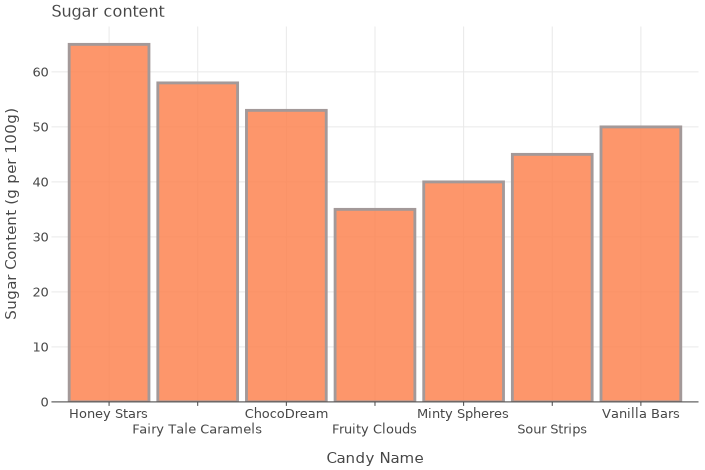

# Examples of Kandy

## Table of Contents

<!--- TOC -->

* [User Guide](#user-guide)
* [IDEA Examples](#idea-examples)
* [Notebook Examples](#notebook-examples)
    * [Line](#line)
    * [Area](#area)
    * [Bars](#bars)
    * [Points](#points)
    * [Error Bars](#error-bars)
    * [Boxplot](#boxplot)
    * [Tiles](#tiles)

<!--- END -->

## User Guide

* [**Quick Start Guide**](https://kotlin.github.io/kandy/quick-start-guide.html) - [Notebook](https://github.com/Kotlin/kandy/blob/main/examples/notebooks/lets-plot/guides/quick_start_guide.ipynb) / [Datalore](https://datalore.jetbrains.com/report/static/KQKedA4jDrKu63O53gEN0z/TKul6gxAVDbJmocwQi9UjB)
* **Geoms**
    * algebraic_curve - Notebook / Datalore
    * error_bars - Notebook / Datalore
    * jitter_points - Notebook / Datalore
    * lines - Notebook / Datalore
    * pie - Notebook / Datalore
    * ribbon - Notebook / Datalore
    * scatter_plot - Notebook / Datalore
* **Statistical**
    * statistics - Notebook / Datalore
    * smoothing - Notebook / Datalore
    * histogram - Notebook / Datalore
    * boxplot - Notebook / Datalore
    * heatmap - Notebook / Datalore
    * countPlot - Notebook / Datalore
    * densityPlot - Notebook / Datalore
* **Multiplot**
    * anscombes_quartet
    * facets
    * plot_bunch
* **Layout customization**
    * label_format - Notebook / Datalore
    * legend_and_axis - Notebook / Datalore
    * themes - Notebook / Datalore
    * title_subtitle_caption - Notebook / Datalore
    * tooltips - Notebook / Datalore
* **Other guides**
    * export_to_file
    * kotlin_notebook_features
    * series_hack

## IDEA examples

[**lets-plot-simple**](idea-examples/lets-plot-simple/src/main/kotlin/org/jetbrains/kotlinx/kandy/letsplot/simple_lets_plot.kt) —
The following is an example of using the `kandy-lets-plot` library in an IntelliJ IDEA project.

___

[**echarts-simple**](idea-examples/echarts-simple/src/main/kotlin/org/jetbrains/kotlinx/kandy/echarts/simple_echarts.kt) —
The following is an example of using the `kandy-echarts` library in an IntelliJ IDEA project.

## Notebook Examples

### Line

<table>
    <tr>
        <td>
            <a href="https://kotlin.github.io/kandy/simple-line.html">
                
                <b>Simple Line</b>
            </a>
        </td>
        <td>
            <a href="https://kotlin.github.io/kandy/line-settings.html">
                
                <b>Line Settings</b>
            </a>
        </td>
        <td>
            <a href="https://kotlin.github.io/kandy/line-with-points.html">
                
                <b>Line with Points</b>
            </a>
        </td>
    </tr>
    <tr>
        <td>
            <a href="https://kotlin.github.io/kandy/fixed-line-coordinate.html">
                
                <b>Fixed Line Coordinate</b>
            </a>
        </td>
        <td>
            <a href="https://kotlin.github.io/kandy/line-gradient.html">
                
                <b>Line Gradient</b>
            </a>
        </td>
        <td>
            <a href="https://kotlin.github.io/kandy/line-with-reversed-axis.html">
                
                <b>Line with Reversed Axis</b>
            </a>
        </td>
    </tr>
    <tr>
        <td>
            <a href="https://kotlin.github.io/kandy/several-lines.html">
                
                <b>Several Lines</b>
            </a>
        </td>
        <td>
            <a href="https://kotlin.github.io/kandy/functional-line-plot.html">
                
                <b>Functional Line Plot</b>
            </a>
        </td>
        <td>
            <a href="https://kotlin.github.io/kandy/marked-line.html">
                
                <b>Marked Line</b>
            </a>
        </td>
    </tr>
    <tr>
        <td>
            <a href="https://kotlin.github.io/kandy/path-line.html">
                
                <b>Path Line</b>
            </a>
        </td>
        <td>
            <a href="https://kotlin.github.io/kandy/step-line.html">
                
                <b>Step Line</b>
            </a>
        </td>
        <td>
            <a href="https://kotlin.github.io/kandy/smoothed-line.html">
                
                <b>Smoothed Line</b>
            </a>
        </td>
    </tr>
    <tr>
        <td>
            <a href="https://kotlin.github.io/kandy/smoothed-curve-with-points.html">
                
                <b>Smoothed Curve with Points</b>
            </a>
        </td>
        <td>
            <a href="https://kotlin.github.io/kandy/comparing-line-vs-path-plots.html">
                
                <b>Comparing Line vs. Path Plots</b>
            </a>
        </td>
    </tr>
</table>

### Area

<table>
    <tr>
        <td>
            <a href="https://kotlin.github.io/kandy/simple-area.html">
                
                <b>Simple Area</b>
            </a>
        </td>
        <td>
            <a href="https://kotlin.github.io/kandy/area-settings.html">
                
                <b>Area Settings</b>
            </a>
        </td>
        <td>
            <a href="https://kotlin.github.io/kandy/fixed-area-coordinate.html">
                
                <b>Area with Fixed Coordinate</b>
            </a>
        </td>
    </tr>
    <tr>
        <td>
            <a href="https://kotlin.github.io/kandy/area-with-reversed-axis.html">
                
                <b>Area with Reversed Axis</b>
            </a>
        </td>
        <td>
            <a href="https://kotlin.github.io/kandy/several-areas.html">
                
                <b>Several Areas</b>
            </a>
        </td>
        <td>
            <a href="https://kotlin.github.io/kandy/functional-area.html">
                
                <b>Functional Area Plot</b>
            </a>
        </td>
    </tr>
    <tr>
        <td>
            <a href="https://kotlin.github.io/kandy/area-with-mark-line.html">
                
                <b>Area with Mark Line</b>
            </a>
        </td>
        <td>
            <a href="https://kotlin.github.io/kandy/smoothed-area.html">
                
                <b>Smoothed Area</b>
            </a>
        </td>
        <td>
            <a href="https://kotlin.github.io/kandy/smoothed-area-with-points.html">
                
                <b>Smoothed Area with Points</b>
            </a>
        </td>
    </tr>
    <tr>
        <td>
            <a href="https://kotlin.github.io/kandy/density-plot.html">
                
                <b>Density Plot</b>
            </a>
        </td>
    </tr>
</table>

### Bars

<table>
    <tr>
        <td>
            <a href="https://kotlin.github.io/kandy/simple-bars.html">
                
                <b>Simple Bar</b>
            </a>
        </td>
        <td>
            <a href="https://kotlin.github.io/kandy/bar-settings.html">
                
                <b>Bar Settings</b>
            </a>
        </td>
        <td>
            <a href="https://kotlin.github.io/kandy/bar-gradient.html">
                
                <b>Bar Gradient</b>
            </a>
        </td>
    </tr>
    <tr>
        <td>
            <a href="https://kotlin.github.io/kandy/fixed-bar-coordinate.html">
                
                <b>Fixed Bar Coordinate</b>
            </a>
        </td>
        <td>
            <a href="https://kotlin.github.io/kandy/bar-with-reversed-axis.html">
                
                <b>Bar with Reversed Axis</b>
            </a>
        </td>
        <td>
            <a href="https://kotlin.github.io/kandy/horizontal-bars.html">
                
                <b>Horizontal Bars</b>
            </a>
        </td>
    </tr>
    <tr>
        <td>
            <a href="https://kotlin.github.io/kandy/grouped-bars.html">
                
                <b>Grouped Bars</b>
            </a>
        </td>
        <td>
            <a href="https://kotlin.github.io/kandy/stacked-bars.html">
                
                <b>Stacked Bars</b>
            </a>
        </td>
        <td>
            <a href="https://kotlin.github.io/kandy/functional-bars.html">
                
                <b>Functional Bar Plot</b>
            </a>
        </td>
    </tr>
    <tr>
        <td>
            <a href="https://kotlin.github.io/kandy/histogram-bar-plot.html">
                
                <b>Histogram Plot</b>
            </a>
        </td>
    </tr>
</table>

### Points

<table>
    <tr>
        <td>
            <a href="https://kotlin.github.io/kandy/basic-points-plot.html">
                
                <b>Basic Points Plot</b>
            </a>
        </td>
        <td>
            <a href="https://kotlin.github.io/kandy/points-settings.html">
                
                <b>Points Settings</b>
            </a>
        </td>
        <td>
            <a href="https://kotlin.github.io/kandy/points-with-abline.html">
                
                <b>Points with ABLine</b>
            </a>
        </td>
    </tr>
    <tr>
        <td>
            <a href="https://kotlin.github.io/kandy/points-gradient.html">
                
                <b>Points Gradient</b>
            </a>
        </td>
        <td>
            <a href="https://kotlin.github.io/kandy/points-with-color-by-category.html">
                
                <b>Points with Color by Category</b>
            </a>
        </td>
        <td>
            <a href="https://kotlin.github.io/kandy/fixed-points.html">
                
                <b>Fixed Points Coordinate</b>
            </a>
        </td>
    </tr>
    <tr>
        <td>
            <a href="https://kotlin.github.io/kandy/jittered-points.html">
                
                <b>Jittered Points</b>
            </a>
        </td>
        <td>
            <a href="https://kotlin.github.io/kandy/bubble-chart.html">
                
                <b>Bubble Chart</b>
            </a>
        </td>
        <td>
            <a href="https://kotlin.github.io/kandy/complex-bubble-chart.html">
                
                <b>Complex Bubble Chart</b>
            </a>
        </td>
    </tr>
    <tr>
        <td>
            <a href="https://kotlin.github.io/kandy/functional-scatter-plot.html">
                
                <b>Functional Scatter Plot</b>
            </a>
        </td>
    </tr>
</table>

### Error Bars

<table>
    <tr>
        <td>
            <a href="https://kotlin.github.io/kandy/simple-errorbars.html">
                
                <b>Simple ErrorBars</b>
            </a>
        </td>
        <td>
            <a href="https://kotlin.github.io/kandy/errorbars-settings.html">
                
                <b>ErrorBars Settings</b>
            </a>
        </td>
        <td>
            <a href="https://kotlin.github.io/kandy/errorbars-with-line.html">
                
                <b>ErrorBars with Line</b>
            </a>
        </td>
    </tr>
    <tr>
        <td>
            <a href="https://kotlin.github.io/kandy/fixed-errorbars.html">
                
                <b>Fixed ErrorBars Coordinate</b>
            </a>
        </td>
        <td>
            <a href="https://kotlin.github.io/kandy/borderline-errorbars.html">
                
                <b>BorderLine in ErrorBars</b>
            </a>
        </td>
        <td>
            <a href="https://kotlin.github.io/kandy/grouped-errorbars.html">
                
                <b>Grouped ErrorBars</b>
            </a>
        </td>
    </tr>
    <tr>
        <td>
            <a href="https://kotlin.github.io/kandy/errorbars-with-boxplot.html">
                
                <b>ErrorBars with Boxplot</b>
            </a>
        </td>
    </tr>
</table>

### Boxplot

<table>
    <tr>
        <td>
            <a href="https://kotlin.github.io/kandy/boxplot-expr.html">
                
                <b>Boxplot of Experiments</b>
            </a>
        </td>
        <td>
            <a href="https://kotlin.github.io/kandy/boxplot-life-exp.html">
                
                <b>Boxplot Life Expectations by Country</b>
            </a>
        </td>
        <td>
            <a href="https://kotlin.github.io/kandy/boxplot-categories.html">
                
                <b>Boxplot Categories</b>
            </a>
        </td>
    </tr>
</table>

### Tiles

<table>
    <tr>
        <td>
            <a href="https://kotlin.github.io/kandy/basic-tile-plot.html">
                
                <b>Basic Tile Plot</b>
            </a>
        </td>
        <td>
            <a href="https://kotlin.github.io/kandy/tiles-settings.html">
                
                <b>Tiles Settings</b>
            </a>
        </td>
        <td>
            <a href="https://kotlin.github.io/kandy/fixed-tiles.html">
                
                <b>Fixed Tiles Coordinate</b>
            </a>
        </td>
    </tr>
    <tr>
        <td>
            <a href="https://kotlin.github.io/kandy/tiles-gradient.html">
                
                <b>Tiles Gradient</b>
            </a>
        </td>
        <td>
            <a href="https://kotlin.github.io/kandy/tiles-color-categories.html">
                
                <b>Tiles with Color by Category</b>
            </a>
        </td>
        <td>
            <a href="https://kotlin.github.io/kandy/basic-heatmap.html">
                
                <b>Basic Heatmap</b>
            </a>
        </td>
    </tr>
    <tr>
        <td>
            <a href="https://kotlin.github.io/kandy/tiles-logo.html">
                
                <b>Ktnb Logo Tiles</b>
            </a>
        </td>
    </tr>
</table>
